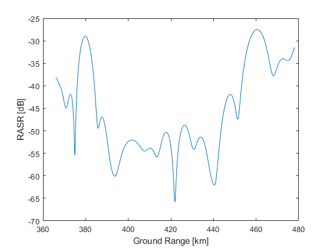

<head>
    
    
</head>

## 系统设计仿真实例
设计要求如图所示  
  

根据轨道高度与脉冲宽度，可以得到斑马图为  
    
选择PRF为1541Hz，对应的下视角范围为 $[31.95^{\circ},38.80^{\circ}]$，测绘宽度为115 km。

### 方位向参数设计

卫星以圆轨道绕地球飞行，可以得到速度 $v_s = 7.575 \enspace km/s$。则地表的波束移动速度为

$$v_g = \frac{R_t cos(\beta) v_s}{R_s}$$

其中 $R_t$为目标到地心距离，也就是地球半径。 $R_s$为雷达到地心距离，也就是卫星轨道半径， $\beta$ 为下视角对应的地面张角。计算得出 $v_g \in [6.9411, 6.9492] \enspace km/s$。由于分辨率要求2m，由方位向分辨率公式

$$\delta_{az} = \frac{0.886v_g cos(\theta_c)}{B_d}$$

可以得到 $B_d = 3077 Hz$。这里计算时，斜视角为0，我们使用3个子带来合成出需要的多普勒频谱，这样PRF就满足要求了。方位向的发射天线长度为

$$L_{a，tx} = \frac{2\delta_{az} v_s}{v_g}$$

代入得到发射天线长度为4.3714 m 约为4.4m。接收天线的子孔径大小不应该大于发射天线长度，这里我们可以设为3.3m，对应的孔径长度为9.9m。

### 距离向参数设计
距离向地距分辨率也为2m。场景中心的下视角为 $35.375^{\circ}$，对应的入射角为 $39.14^{\circ}$。所以斜距分辨率为 $2sin(\eta_c) = 1.26 \enspace m$。
根据距离分辨率的公式

$$\delta_el = \frac{\rho_r c}{2}= \frac{c}{2B}$$ 

得出距离向带宽为

$$B = \frac{0.886c}{2 \delta_el} = 118.97 Mhz$$

方位向发射天线要求主瓣3db宽度覆盖场景。所以根据视角范围场景的发射波束宽度为 $\theta_{el} = 6.85^{\circ}$。载频为9.65 GHz，对应的波长为3.11 cm。所以发射天线的高度为

$$d_{el,tx} = \frac{0.886 \lambda}{\theta_{el}} = 0.2302 \enspace m$$

对于接收端，接收波束的3dB宽度应该小于脉冲的地面瞬时覆盖范围，设接收天线的高度为 $h_{el}$

$$\frac{0.886 \lambda}{h_{el}} \leq \frac{cT}{2tan\eta}$$

得出天线高度为

$$h_{el} \geq 0.886 \frac{2 \lambda R_{max} tan(\eta_{max})}{cT}$$

 $R_{max}$ 与 $\eta_{max}$ 为测绘带远端的斜距与入射角。带入得到 $h_{el} = 3.27 \enspace m$
子孔径的长度可以通过评估RASR得到，这里我们不妨设为0.327 m。
### 性能评估
如下图所示，均满足要求。
#### AASR
   

#### RASR

   

#### NESZ

   

