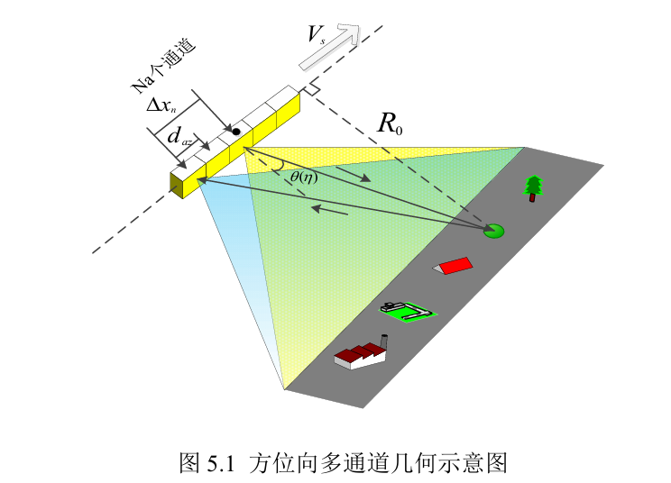
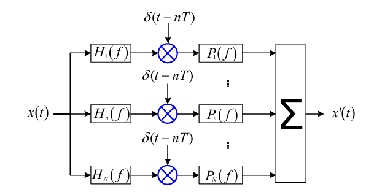
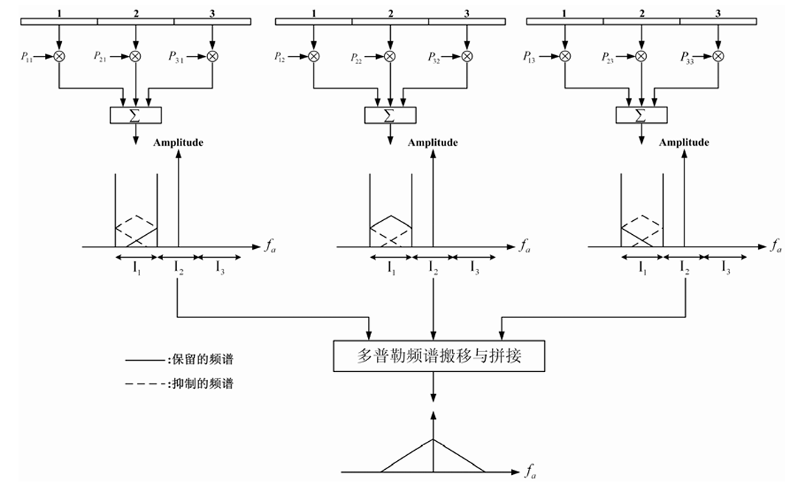

<head>
    
    
</head>

## 重构滤波器

在方位向，使用多个雷达子天线接收回波可以降低PRF的需求，处理更大的多普勒带宽，实现更高的方位向分辨率。可是当多普勒带宽大于PRF时，方位向信号会发生混叠。那么是否能够从多个天线接收的混叠回波中恢复出原始信号呢，答案是可行的。

### 子天线间的回波差异
  
如图所示，设雷达子天线方位向长度为 $d_{az}$。雷达到点目标的最短斜距为 $R_0$。则第n个通道接收到的方位向信号为 

$$\mu_n(\eta) = \sigma D(\theta(\eta)) exp[-j \frac{2 \pi}{\lambda}(\sqrt{R_0^2 + (V_s\eta)^2}+\sqrt{R_0^2 + (V_s \eta - \Delta x_n)^2})]$$

其中 $\sigma$ 表示目标的后向散射系数，$D(\theta(\eta))$ 表示天线方向图。 $\theta(\eta)$ 为目标视线方向与天线法线的夹角。$V_s$ 为雷达速度， $\lambda$ 为雷达信号波长，$\Delta x_n$ 为当前天线与参考天线的相位中心间距。

$$ \Delta x_n = (n_{ref} - n) d_{az}$$ 

我们这里可以直接把中心天线看成参考天线，这个的选择不影响结果。我们对第 $n$ 个通道接收到的回波信号的相位进行泰勒展开

$$ \mu_n(\eta) \approx \sigma D(\theta(\eta)) exp[-j \frac{4 \pi}{\lambda}R_0 - j\frac{\pi \Delta x_n^2}{2 \lambda R_0} - j\frac{2 \pi V_s^2}{\lambda} \frac{(\eta-\frac{\Delta x_n}{2V_s})^2}{R_0}] $$

当 $n = n_{ref}$ 时， $\Delta x_n = 0$ ，参考回波信号为

$$ \mu_{ref}(\eta) \approx \sigma D(\theta(\eta))exp(-j \frac{4 \pi}{\lambda}R_0 -j\frac{2\pi V_s^2}{\lambda} \frac{\eta^2}{R_0}) $$

对两个信号做傅里叶变换，对比可知第 $n$ 个通道的回波信号在频域上与参考信号的差异为

$$ \Mu_n(f_{\eta}) = exp(-j \frac{\pi \Delta x_n^2}{2 \lambda R_0} - j \pi \frac{\Delta x_n}{V_s} f_{\eta}) \Mu_{ref}(f_{\eta})$$

只需要注意到第一项与 $\eta$ 无关，第二项是满足时移关系。变换到时域可以得到

$$ \mu_n(\eta) \approx exp(-j\frac{\pi \Delta x_n^2}{2 \lambda R_0})\mu_{ref}(\eta - \frac{\Delta x_n}{2 V_s}) $$

可以看出第 $n$个通道的回波等效于参考通道延时的效果。如果有 $N_a$ 个这样的通道，每个脉冲可以得到 $N_a$个方位采样点，这效果相当于PRF 翻了 $N_a$ 倍。现在剩下的问题是如何从数据中恢复出原始回波信号。

### 重构滤波
  
如图所示。我们知道混叠的各个信号是在同一个频带的，简单的低通，带通什么的滤波器无用。但我们首先可以明确的是，混叠本身是对原始信号的一种线性变换。把信号在频域上以小于带宽的方式进行平移就可以产生混叠，这种平移操作显然是一种线性变换。我们也知道线性变换是可以用矩阵表示，如果矩阵满秩，则这种线性变换是有逆变换的。而逆变换，把混叠信号变成原始信号，就是我们想要的。  
从上一节的推导中，我们知道第 $n$ 个通道与参考通道的回波在频域上的关系，这种关系可以用一个系统函数表示，我们称其为预滤波。

$$H_n(f_\eta) = exp(-j \frac{\pi \Delta x_n^2}{2 \lambda R_0} - j \pi \frac{\Delta x_n}{V_s} f_{\eta})$$
 
第一项比较小，一般可以忽略。有了系统函数，我们是否可以直接求逆得到重构函数呢？不可以，因为单独一个子通道带宽小于多普勒带宽，信息量不足以支持重构，需要对所有的子通道进行综合才行。考虑所有子通道在 $N_a PRF$的带宽与参考通道的差异，将所有子通道的回波信号恢复成一个 $PRF$宽的，正确的子带，然后进行拼接才能得到我们想要的信号。或者说，这 $N_a$ 通道的回波拼接成的信号才算一个完整的混叠信号。因此构成矩阵

$$\bf{H}(f_\eta) = \begin{pmatrix}
H_1(f_\eta) & \cdots & H_{N_a}(f_\eta)\\
H_1(f_\eta + PRF) & \cdots & H_{N_a}(f_\eta + PRF)\\
H_1(f_\eta + (N_a-1)PRF) & \cdots & H_{N_a}(f_\eta + (N_a-1)PRF)\\
\end{pmatrix} $$

对应的重构滤波器为

$$\bf{P}(f_\eta) = \bf{H}^{-1}(f_\eta)$$

使用该函数对每个通道进行重构滤波，然后拼接即可。

