# 雷达系统设计1

## 雷达点目标方程
SAR 是一种特殊的实孔径雷达，了解雷达，首先需要了解雷达系统的基本数学模型，雷达方程。从雷达的系统结构出发，分析雷达信号的走向，可以得到基础，简单的雷达方程。
### 发射
雷达信号首先需要经过天线发射出来，这里就涉及到雷达发射系统的基本结构。
1. 源-提供信号
2. 发射器-将信号辐射到空间中  
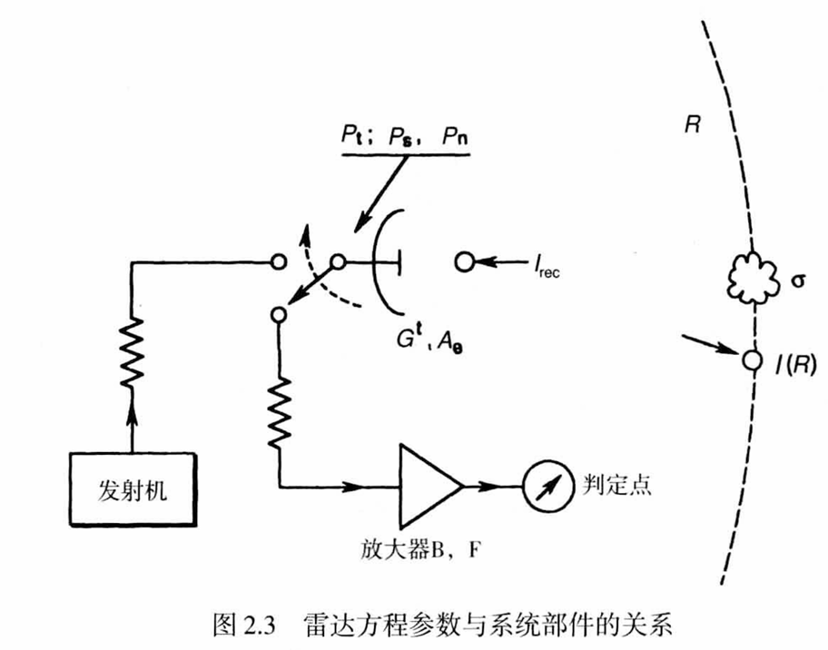

#### 源
将源理解为简单的信号提供装置，无论其内部结构有多复杂，都只为了输出一个带有一定能量的干净的信号。其关键的参数为输出功率$P_t$。

#### 辐射
将信号辐射到空间中的装置为天线。最基本的天线为全向天线，其就是一个简单的振荡源，将信号以波的形式，全方向，等功率的辐射出去。就像膨胀的气球，为了满足能量守恒定义，且假设为真空环境。所以，距离天线$R$的单位面积，其获得的功率为$P = \frac{P_t}{4\pi R^2}$。对于这种类似速度的物理量，我们可以为了方便单独为其命名，比如命名为功率强度$I$。$$I(R) = \frac{P_t}{4\pi R^2}$$  

#### 增益
可是我们的目标很有可能只是在某一方向的很小的一个点，如果将能量全向辐射就过于浪费了。所以将全向天线进行升级，让天线尽可能的将能量辐射到一个方向，这样相较于全向天线，这个不同方向的强度就不一样了,相当于获得了一个增益$G$， $$I_{tran} =  \frac{G P_t}{4\pi R^2}$$ 当然，能量守恒定理是必须满足的，一个方向增强，另一个方向就要衰弱。设球面为$S$，则$I(R)$满足$$\int_S I(R) = P_t$$
### 接收

#### 目标散射

辐射出去的能量与光本质上没有多少不同，所以它能够被遇到的物体反射回来。根据物体的表面材质不同，其辐射回来的能量大小也不同，我们可以设一个参数$\sigma$来表现物体反射信号的能力大小，为了避免物体大小对其产生影响，这个参数是相对于单位面积来计算的。显然，我们不能假定目标物体就像我们设计的天线一样，指向一个方向，所以其实称其为散射会更好，不妨设物体全向散射，雷达保持不同，则接收到的信号强度为
$$I_{recv} = \frac{\sigma I_{tran}}{4 \pi R^2} = \frac{P_t G \sigma}{(4 \pi R^2)^2}$$ 

对于接收信号，天线也有一个增益（也有可能是衰减）$A$，其被称为天线接收孔径，最终雷达接收到的功率为
$$P_s = A I_{recv} = \frac{P_t G \sigma A}{(4 \pi R^2)^2}$$

### 噪声
考虑完有用信号的接收功率，就需要考虑整个过程中无处不在的噪声的影响了。

首先肯定是热噪声，就像热力学里所讲的，这个噪声单位频带宽度的功率为$$N = kT$$
其中$k = 1.38 \times 10^{-23}$，为玻尔兹曼常数。T为温度。如果接收机的带宽为$B$，则噪声功率为$$P_{n1} = kTB$$
除此之外，接收机自己也会产生噪声，相当于在热噪声上加一个其他噪声，为简单起见，可以设一个参数$F$，表示接收机对热噪声的增加程度 $$P_n = FkTB$$

### 天线增益

#### 方向图

天线方向图在之后的模糊分析里会用到，这里简单记录一下。
天线方向图与天线增益相关，需要更加详细的理解天线增益。当能量被天线辐射出去后，使用功率来描述就不太合适了。因为即使随着传播距离的增加，总功率依旧不变，但显然，对于单个的点来说，功率衰减了。使用能量密度或者强度更合适，来表述能量的传播。$$I(R) = Re(E \times H^*)$$ 对于天线的远场辐射情况下，$$I(R) = \sqrt\frac{\varepsilon}{\mu} |E|^2$$
考虑到单位面积的功率会随着距离衰减，描述方向功率时，使用立体角表示方向更合适。对于某个立体角，功率可以由强度得到。$$P(\theta, \phi) = R^2 I(R) = R^2\sqrt\frac{\varepsilon}{\mu}|E|^2$$ 天线增益是相较于全向天线而言的。对于全向天线，$$P_t(\theta, \phi) = \frac{P_t}{4\pi}$$
所以增益为
$$G^t(\theta, \phi) = \frac{P(\theta, \phi)}{P_t(\theta, \phi)} = \frac{4\pi R^2}{P_t}\sqrt\frac{\varepsilon}{\mu}|E|^2$$
可以看出，天线增益与立体角，也就是方向有关。将天线增益归一化，得到方向图
$$d^t(\theta, \phi) = G^t(\theta, \phi)/G^t$$
$G^t$ 为天线增益最大值。
不同形状的天线有着不同的方向图，在sar中，常用的为矩形天线。这是因为天线高度决定成像带宽与距离模糊，天线长度决定方位模糊，prf，方位向分辨率。考虑长$L_a$，高$W_a$的天线。将天线远场辐射的电场强度带入，沿主方向截面$\phi = 0$，求出天线方向图为
$$d^t(\theta, \phi) = sinc^2(\frac{\pi L_a}{\lambda}sin\theta)$$
这里
$$sinc(x) = \frac{sin(x)}{x}$$

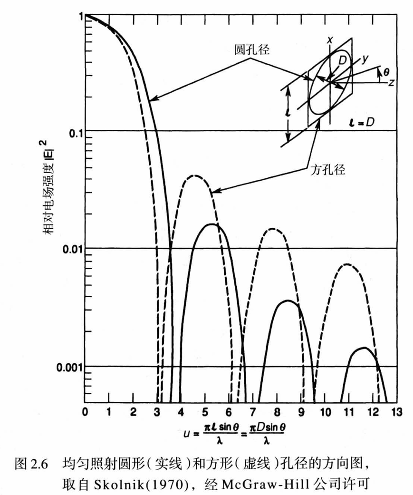

#### 孔径
接下来我们考虑天线孔径的问题。天线增益不仅决定方向图，还与天线孔径有关。在上诉天线增益表达式中，我们带入远场辐射的电场强度的表达式。可以得到
$$G^t(\theta, \phi) = [\pi\sqrt{\frac{\varepsilon}{\mu}}/(\lambda^2 P_t)]|1+cos\theta|^2 \times |\int_{A_a}E(x,y)exp[j(\frac{2\pi}{\lambda}sin\theta)(xcos\phi + ysin\phi)]dxdy|^2$$
这里$E(x,y)$为天线表面的电场强度，$A_a$为天线的几何表面，即如果天线为长$L$宽$W$的矩形，则 
$$A_a = L \times W$$
增益在天线轴$\theta = 0$上最大，
$$G^t = G^t(0,\phi) = [2\pi\sqrt{\frac{\varepsilon}{\mu}}/\lambda^2 P_t]|\int_{A_a}E(x,y)dxdy|^2$$
此时，利用坡印廷定理，天线的发射功率为$P_{rad} = [\sqrt{\frac{\varepsilon}{\mu}}]\int_{A_a}|E(x,y)|^2dxdy$
天线的发射效率定义为
$$\rho_e = \frac{P_{rad}}{P_t}$$
所以天线方向性系数为
$$D^t = \frac{G^t}{\rho_e} = (\frac{4\pi}{\lambda})\frac{|\int_{A_a}E(x,y)dxdy|^2}{\int_{A_a}|E(x,y)|^2dxdy}$$
由柯西-施瓦兹不等式可得
$$|\int_{A_a}E(x,y)dxdy|^2 \leq A_a \int_{A_a}|E(x,y)|^2dxdy$$
所以$$D^t \leq \frac{4 \pi A_a}{\lambda^2}$$
这个是理论最大，实际上会出现一些损耗，
$$\rho_a = \frac{D^t}{D_0}$$
其中$D_0 = max(D^t) = \frac{4 \pi A_a}{\lambda^2}$。这里可以看到天线面积影响了增益，而天线的几何面积为最大的可能增益，实际会更小一点，定义损耗为$\rho_a$。这样可以得到
$$G^t = \rho_e D^t = \rho_e \rho_a D_0 = \rho D_0 = \frac{4\pi A_a \rho}{\lambda^2} = \frac{4 \pi A_e}{\lambda^2}$$
$$\rho = \rho_a \rho_e$$
$$A_e = \rho A_a$$
$A_e$为天线的有效孔径。
### 分布目标

在遥感应用中，目标是分布的。在上诉讨论中，我们可以汇总出点目标的雷达方程
$$SNR = \frac{P_t G^t \sigma A_e}{(4 \pi R^2)^2 k F_{op} T_s B_n}$$
其中，$F_{op}$为工作噪声系数，$T_s$为总的源等效噪声温度， $k$为玻尔兹曼常数。但遥感需要分辨的是一个场景，场景中存在多个点目标。同时雷达也被分辨率约束，导致其可分辨的最小目标单元也远比理想的点目标大。因此我们需要更加关注目标，得出目标性质，它是否可以简单地被$\sigma $ 所描述。  
考虑到一个场景分辨单元是具有一定面积的材质，它不可能整体一直保持统一性质，所以使用平均的后向散射系数$\sigma^0$更加合适。并且从一个场景分辨单元到另一个场景分辨单元，其$\sigma^0$不同。$\sigma^0$更应该被视为随机变量，或者随照射角度变化的函数$\sigma^0(\theta, \phi)$。同样根据之前的分析，天线增益，无论是发射还是接收，也是随照射方向，或者点目标的改变而变化的值$G(\theta, \phi)$，而孔径与增益是相关，因此孔径也会随着方向变化$A_e(\theta, \phi)$。所以雷达方程中，如果描述一个场景，应该是场景中各个点目标的积分。$$SNR = \frac{P_t}{F_{op}k T_s B_n} \int \frac{ G^t(\theta,\phi)\sigma^0(\theta,\phi)A_e(\theta,\phi)}{(4 \pi R(\theta,\phi)^2)^2}dA$$
注意，随着目标的改变，斜距也会发生变化。
对于接收天线，孔径可以换算为增益$$A_e = \frac{\lambda^2 G^r}{4 \pi}$$
如果天线同时承担了接收与发射的任务，那么根据互易定理 $$G^r = G^t = G$$
带入，并将常数提取出积分，可以得到
$$SNR = \frac{\lambda^2 P_t}{(4 \pi)^3 F_{op}k T_s B_n} \int \frac{ G^2(\theta,\phi)\sigma^0(\theta,\phi)}{R(\theta,\phi)^4}dA$$
现在这个雷达方程比较复杂，特别是包含了一个含义模糊的积分。这对分析无益，我们可以尝试化简一下。首先可以先把$\sigma^0$视为常数，这是可能的，假如我们现在的场景足够单一。其次将斜距近似常数，其等于测绘带的中央位置。然后让天线的增益足够大，足够宽，以至于$G$也被视为常数，而在波束外面，增益为0。 因此
$$\int_{S}\frac{G^2(\theta, \phi) \sigma^0(\theta, \phi)}{R(\theta, \phi)^4} = \frac{\sigma^0 G^2 S}{R^4}$$
其中 $S$为覆盖区面积。我们只考虑天线主瓣照射的区域，其方位向张角为
$$\theta_H = 0.886 \frac{\lambda}{L_a} \approx \frac{\lambda}{L_a}$$ 
$L_a$为矩形天线的长度。所以方位向的照射长度近似为$R \theta_H$
在距离向，覆盖区的极限与雷达脉冲的时间长度$\tau_p$有关，在任何时刻，雷达回波信号都包含斜距跨度$\Delta R = \frac{c\tau_p}{2} $的成分，对应的距离向覆盖区为$\frac{\Delta R}{sin\eta}$，$\eta 为入射角$。所以覆盖区面积为
$$S = R\theta_H \times \frac{\Delta R}{sin\eta} = \frac{R \lambda c\tau_p}{2 L_a sin \eta}$$
最终得到雷达方程为
$$SNR = \frac{P_t G^2 \sigma^0 \lambda^2 \theta_H c \tau_p}{2 (4 \pi R)^3 F_{op} k T_s B_n sin\eta}$$

### 理解
在阅读过程中，我不是很理解为什么书中为什么使用了很大的篇幅描述了噪声的来源，为什么不像描述接收孔径一样，表明噪声系数$F$为包络万象的参数。
对于为什么雷达方程是一个关于信噪比的表达式，我的理解是就像通信系统SNR决定了传输速度，SNR决定了雷达的各项参数，它表明了雷达系统与所在环境的整体影响。虽然雷达不只是简单的发送与接收，但最基本的东西仍然是发送出去的东西能否很好的接收到。

## 模糊分析

### 距离模糊

#### 成因
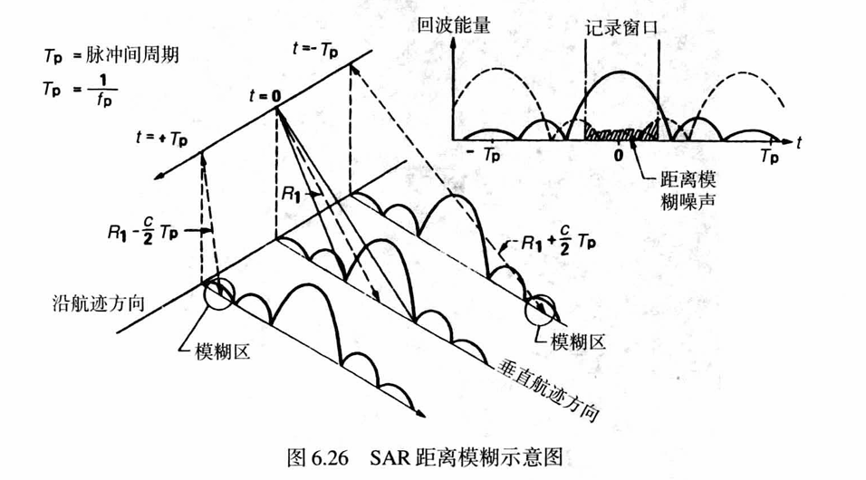  

距离模糊是由与所需回波同时到达天线的前一个和后一个脉冲的回波造成的。天线辐射时，除了测绘带散射天线方向图的主瓣外，测绘带以外的地方也会散射天线方向图的旁瓣。由于斜距的不同，旁瓣的散射不会反馈到当前的PRI中，而是出现延时。如果斜距之差刚好满足$$\Delta R = j\frac{c}{2f_{PRF}}，j = \pm1,\pm2,\cdots,\pm n$$
则旁瓣的回波会反馈到之前或者之后的回波中。由于距离的问题，一个脉冲从发射到接收需要几个脉冲周期的时间。为了避免邻近脉冲的主瓣的影响，显然PRI需要满足$$PRI > \frac{2\lambda R tan\eta}{c Wa}$$
$Wa$为天线宽度，与距离向有关。

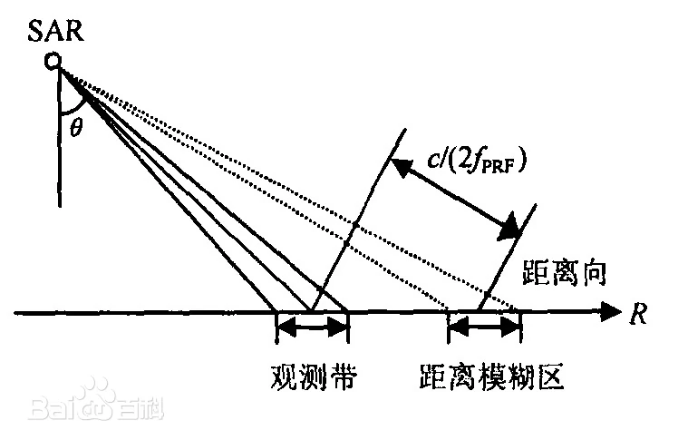  

如果所示，不是主瓣干扰，那么应该是同一时间的旁瓣干扰。对应的斜距为$$R_j = R \pm \Delta R = R \pm j\frac{c}{2 f_{PRF}}，j = \pm 1, \pm 2, \cdots, \pm n$$

#### 评估方式

距离模糊使用RASR进行描述。此时PRF已经被给定，这里我们设为$f_p$。RASR 被定义为想要的信号功率和距离模糊产生的干扰功率之比。此时噪声可以近似相同，使用雷达方程可以得出
$$RASR = \sum_{j=-n}^n \frac{SNR_j}{SNR}$$
$SNR_j$为距离模糊的信号，带入实际的雷达方程，可以化简得到
$$RASR = \sum_{j=-n}^n \frac{\sigma_j^0 G_j^2 / (R_j^3 sin\eta_j)}{\sigma^0 G^2 / R^3 sin \eta}$$
G为天线增益，上述表达式中双程为$G^2$。如果收发天线不同，需要改为$G^tG^r$

### 方位模糊     

#### 成因
方位模糊是由某个PRF上的方位向频谱的有限采样造成的。SAR的多普勒频谱不是严格带限的（由天线旁瓣造成），由于多普勒频谱是由PRF间隔重复的，所以PRF外的频率分量就折回到频谱的主要部分中，对主要部分产生影响。
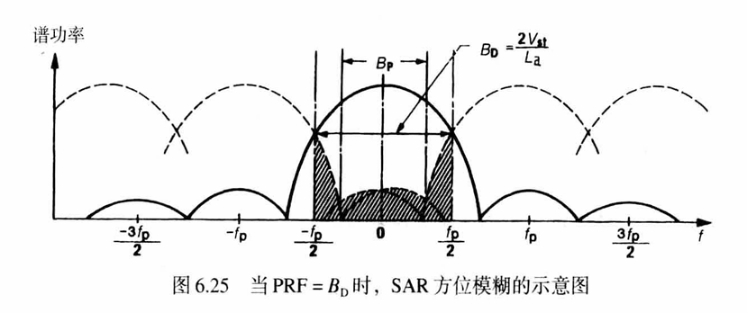  

#### 评估方式
方位模糊使用方位模糊比$AASR$评估。
$$AASR \approx \sum_{m=-\infty,m \neq 0}^{+\infty}\frac{\int_{-B_p/2}^{B_p/2}G^2(f+mf_p)df}{\int_{-B_p/2}^{B_p/2}G^2(f)df}$$
其中$f$为方位向的多普勒频率，$B_p$为多普勒带宽。  
在雷达方程的推导中，已经得到天线增益与$\theta$，$\lambda$存在关系，但不含多普勒频率$f$。所以需要得到天线增益与多普勒频率的关系。我们知道相对移动会造成多普勒频移，设雷达移动速度为$v$，斜视角为$\theta_r$，载波波长为$\lambda$，则多普勒频率为
$$f_d = \frac{2v sin\theta_r}{\lambda}$$
天线增益为
$$G = sinc^2(\frac{\pi L_a sin\theta_r}{\lambda})$$
$L_a$为方位向天线长度，将$sin\theta_r$ 与$\lambda$用$f_d$替换，可以得到
$$G = sinc^2(\frac{\pi L_a f_d}{2v})$$

### PRF 选择
 
#### 下视角与入射角，地距与斜距
在讨论PRF的选择时，需要先理清下视角与入射角，地距与斜距的关系。
下视角是目标雷达连线与星下点雷达连线的夹角。入射角是斜距与地面法线的夹角，如果是地球为球体，则也是地球半径延长线与斜距的夹角。地距是目标到星下点的距离，斜距是雷达到目标的距离。这样我们可以得到一些关系式。  
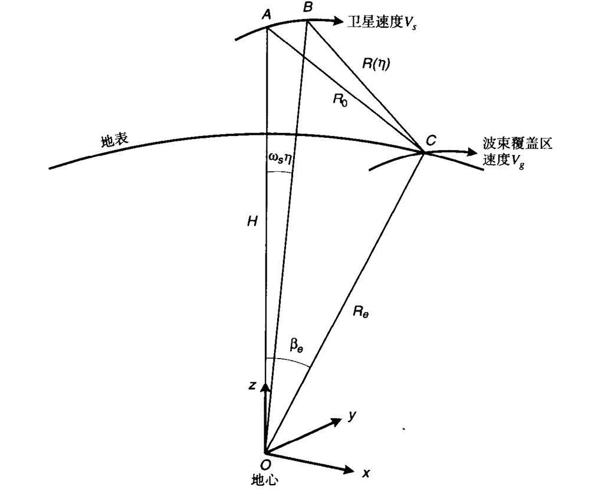   
设入射角为$\eta$，下视角为$\gamma$，地距对应的张角为$\beta$，斜距为$R(\eta)$，地距为$W$，雷达到地心的距离$R_s$，目标到地心的距离为$R_t$。则有
$$\eta = arcsin(\frac{R_s sin(\gamma)}{R_t})$$
下视角可以由斜距得到
$$\gamma = arccos(\frac{R(\eta)^2+R_s^2-R_t^2}{2R(\eta)R_s})$$
斜距，也可以由地距推得
$$\beta = \frac{W}{R_t}$$
$$R(\eta) = \sqrt{R_s^2+R_t^2-2R_s^2 R_t^2 cos(\beta)}$$

#### 斑马图
较低的PRF会增加方位向频谱的混叠，较高的PRF会减少脉冲间的时间，导致接收回波发生交叠。所以选择一个比较合适的PRF是比较重要的。
首先需要保证的是接收回波与发射脉冲不要发生重叠。如果满足以下条件，则发生干扰
$$T_{emin} = \frac{2R_{min}}{c} = j T_{pri} - \tau - \tau_g，j = 0, \pm 1, \pm 2, \cdots, \pm n$$
$$T_{emax} = \frac{2R_{max}}{c} = j T_{pri} + \tau + \tau_g，j = 0, \pm 1, \pm 2, \cdots, \pm n$$
而星下点干扰对PRF选择的限制条件为
$$\frac{2H}{c} + jT_{pri} > \frac{2R_{max}}{c}，j = 0, \pm 1, \pm 2, \cdots, \pm n$$
$$\frac{2H}{c} + jT_{pri} + 2\tau < \frac{2R_{min}}{c}，j = 0, \pm 1, \pm 2, \cdots, \pm n$$
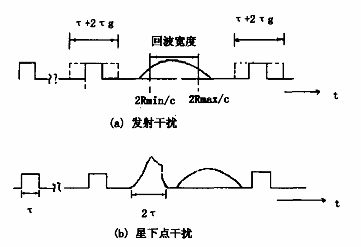  
$H$为雷达高度。星下点回波的持续时间不一定为$2 \tau$，它与地形特点有关。

### 等效后向散射系数
等效后向散射系数NESZ，也是雷达系统的灵敏度，是衡量雷达对弱目标成像能力的指标，其物理意义相当于雷达图像输出信噪比为0dB时，对应目标的后向散射系数。通过点目标的雷达方程，我们可以推导出NESZ的解析式。

## 系统设计仿真实例
设计要求如图所示  
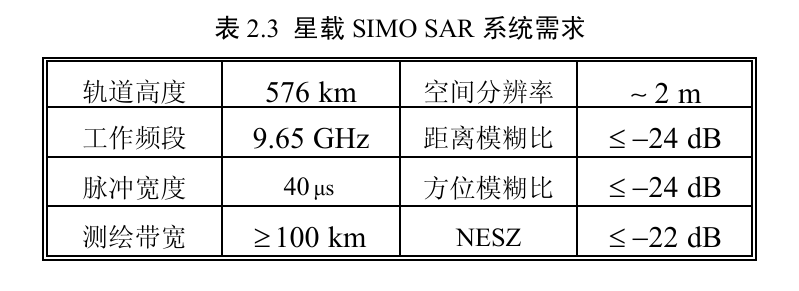  

根据轨道高度与脉冲宽度，可以得到斑马图为  
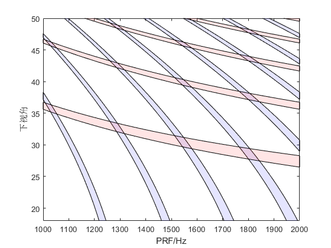    
选择PRF为1541Hz，对应的下视角范围为$[31.95^{\circ},38.80^{\circ}]$，测绘宽度为115 km。
卫星以圆轨道绕地球飞行，可以得到速度$v_s = 7.575 \enspace km/s$。则地表的波束移动速度为
$$v_g = \frac{R_t cos(\beta) v_s}{R_s}$$
其中$R_t$为目标到地心距离，也就是地球半径。$R_s$为雷达到地心距离，也就是卫星轨道半径，$\beta$为下视角对应的地面张角。计算得出$v_g \in [6.9411, 6.9492] \enspace km/s$。由于分辨率要求2m，由方位向分辨率公式

### 方位向参数设计
$$\delta_{az} = \frac{0.886v_g cos(\theta_c)}{B_d}$$
可以得到$B_d = 3077 Hz$。这里计算时，斜视角为0，我们使用3个子带来合成出需要的多普勒频谱，这样PRF就满足要求了。方位向的发射天线长度为
$$L_{a，tx} = \frac{2\delta_{az} v_s}{v_g}$$
代入得到发射天线长度为4.3714 m 约为4.4m。接收天线的子孔径大小不应该大于发射天线长度，这里我们可以设为3.3m，对应的孔径长度为9.9m。

### 距离向参数设计
距离向地距分辨率也为2m。场景中心的下视角为$35.375^{\circ}$，对应的入射角为$39.14^{\circ}$。所以斜距分辨率为$2sin(\eta_c) = 1.26 \enspace m$。
根据距离分辨率的公式
$$\delta_el = \frac{\rho_r c}{2}= \frac{c}{2B}$$
得出距离向带宽为
$$B = \frac{0.886c}{2 \delta_el} = 118.97 Mhz$$
方位向发射天线要求主瓣3db宽度覆盖场景。所以根据视角范围场景的发射波束宽度为$\theta_{el} = 6.85^{\circ}$。载频为9.65 GHz，对应的波长为3.11 cm。所以发射天线的高度为
$$d_{el,tx} = \frac{0.886 \lambda}{\theta_{el}} = 0.2302 \enspace m$$
对于接收端，接收波束的3dB宽度应该小于脉冲的地面瞬时覆盖范围，设接收天线的高度为$h_{el}$
$$\frac{0.886 \lambda}{h_{el}} \leq \frac{cT}{2tan\eta}$$
得出天线高度为
$$h_{el} \geq 0.886 \frac{2 \lambda R_{max} tan(\eta_{max})}{cT}$$
$R_{max}$与$\eta_{max}$为测绘带远端的斜距与入射角。带入得到$h_{el} = 3.27 \enspace m$
子孔径的长度可以通过评估RASR得到，这里我们不妨设为0.327 m。
### 性能评估
如下图所示，均满足要求。
#### AASR
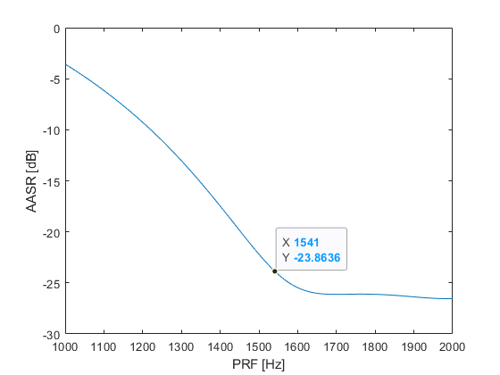   

#### RASR

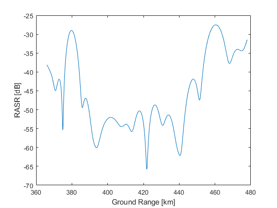   

#### NESZ

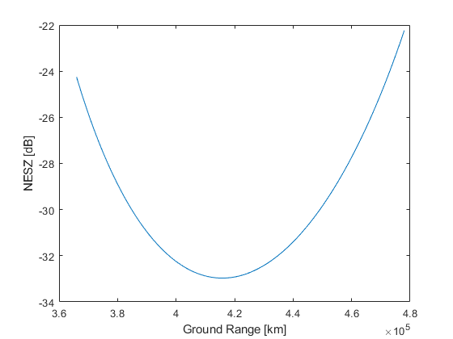   

